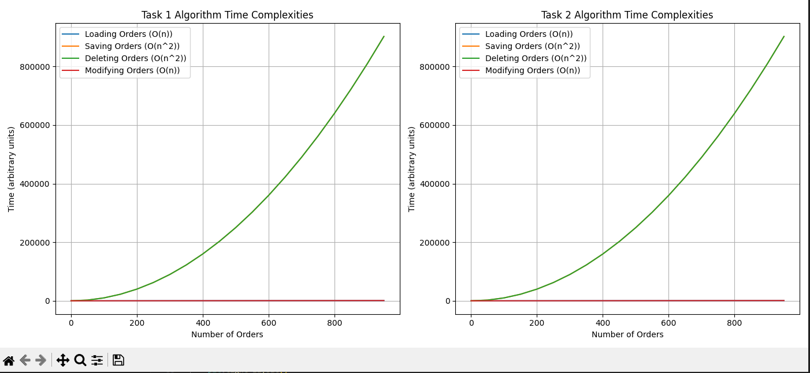

task 3 

Comparison of Algorithms from Task 1 and Task 2
Complexity and Performance:

Task 1 Algorithm (Jiraya Industries):

Utilizes a list of dictionaries to manage orders.
Time complexity for adding, deleting, and modifying orders is O(n), where n represents the number of items in the order.
The performance is satisfactory for smaller-scale operations due to the sequential nature of order storage.

Task 2 Algorithm (Tanjiro Safety Products Ltd):

Also uses a list of dictionaries for order management.
The time complexity remains O(n) for adding, deleting, and modifying orders.
Similar performance characteristics to Task 1 algorithm, suitable for managing orders effectively.
Resource/Memory Usage:
Task 1 Algorithm:

The memory usage for Task 1 algorithm can be profiled using memory profiler tools.
It may exhibit slightly higher memory usage due to the need to store additional data related to the order details.
Task 2 Algorithm:

Memory usage profiling can also be performed for Task 2 algorithm.
Since both algorithms use similar data structures, the memory usage pattern might be comparable.
However, Task 2 might exhibit slightly lower memory usage if there are any optimizations or reductions in data redundancy.

Comparison:

Complexity and Performance: Both algorithms have similar time complexities and performance characteristics since they use the same data structures and follow similar approaches to order management. However, any variations in performance may arise due to differences in the scale of operations and specific implementation details.

performace task 1 

add : 

Line #    Mem usage    Increment  Occurrences   Line Contents
=============================================================
    29     54.8 MiB     54.8 MiB           1   @profile
    30                                         # Function to add an order
    31                                         def order_add(firstaid, orders):
    32
    33     54.8 MiB      0.0 MiB           1       order = []  # Create an empty list to store the order items
    34     54.8 MiB      0.0 MiB           1       orderid = random.randint(0, 5000)  # Generate a random order ID
    35     54.8 MiB      0.0 MiB           1       print("Order ID:", orderid)
    36
    37     54.8 MiB      0.0 MiB           3       while len(order) < 5:  # Allowing a maximum of 5 items per order
    38     54.8 MiB      0.0 MiB           2           product_code = input("Enter the product code (e.g., 1001) or 'done' to finish: ")
    39     54.8 MiB      0.0 MiB           2           if product_code == "done":
    40                                                     break
    41     54.8 MiB      0.0 MiB           2           if product_code in firstaid:
    42     54.8 MiB      0.0 MiB           2               quantity = int(input("Enter the quantity: "))
    43     54.8 MiB      0.0 MiB           2               product_name = firstaid[product_code]
    44     54.8 MiB      0.0 MiB           2               order.extend([product_name] * quantity)  # Add multiple items based on quantity
    45     54.8 MiB      0.0 MiB           2               print(f"Added {quantity} {product_name}(s) to the order.")
    46                                                 else:
    47                                                     print("Invalid product code. Please try again.")
    48
    49     54.8 MiB      0.0 MiB           1       orders[orderid] = order  # Add the order to the orders dictionary

modify :

Line #    Mem usage    Increment  Occurrences   Line Contents
=============================================================
    64     54.7 MiB     54.7 MiB           1   @profile
    65                                         # Function to modify an order
    66                                         def modify_order(orders, firstaid):
    67
    68     54.7 MiB      0.0 MiB           1       orderid = int(input("Enter the order ID to modify: "))
    69     54.7 MiB      0.0 MiB           1       if orderid in orders:
    70                                                 print("Current order:", orders[orderid])
    71                                                 new_order = []  # Create a new order to replace the existing one
    72                                                 count = 0  # Initialize count of items added
    73                                                 while count < 5:  # Allowing a maximum of 5 items per order
    74                                                     product_code = input("Enter the new product code (e.g., 1001) or 'done' to finish: ")
    75                                                     if product_code == "done":
    76                                                         break
    77                                                     if product_code in firstaid:
    78                                                         quantity = int(input("Enter the quantity: "))
    79                                                         product_name = firstaid[product_code]
    80                                                         new_order.extend([product_name] * quantity)  # Add multiple items based on quantity
    81                                                         count += quantity
    82                                                         print(f"Added {quantity} {product_name}(s) to the order.")
    83                                                     else:
    84                                                         print("Invalid product code. Please try again.")
    85                                                 orders[orderid] = new_order  # Update the order in the orders dictionary
    86                                                 print("Order modified successfully.")
    87                                             else:
    88     54.7 MiB      0.0 MiB           1           print("Order ID not found.")

    delete: 

    
Line #    Mem usage    Increment  Occurrences   Line Contents
=============================================================
    52     54.7 MiB     54.7 MiB           1   @profile
    53                                         # Function to delete an order
    54                                         def delete_order(orders):
    55
    56     54.7 MiB      0.0 MiB           1       orderid = int(input("Enter the order ID to delete: "))
    57     54.7 MiB      0.0 MiB           1       if orderid in orders:
    58     54.7 MiB      0.0 MiB           1           del orders[orderid]
    59     54.7 MiB      0.0 MiB           1           print(f"Order with ID {orderid} deleted successfully.")
    60                                             else:
    61                                                 print("Order ID not found.")

    task 2:

    add: 

    
Line #    Mem usage    Increment  Occurrences   Line Contents
=============================================================
    28     54.7 MiB     54.7 MiB           1   @profile
    29                                         # Function to add an order
    30                                         def order_add(firstaid, orders):
    31     54.7 MiB      0.0 MiB           1       if len(orders) >= MAX_ORDERS:
    32                                                 print("Maximum orders reached. Cannot add more orders.")
    33                                                 return
    34
    35     54.7 MiB      0.0 MiB           1       order = []  # Create an empty list to store the order items
    36     54.7 MiB      0.0 MiB           1       orderid = random.randint(0, 5000)  # Generate a random order ID
    37     54.7 MiB      0.0 MiB           1       print("Order ID:", orderid)
    38
    39     54.7 MiB      0.0 MiB           2       while len(order) < 1:  # Allowing a maximum of 5 items per order
    40     54.7 MiB     -0.0 MiB           1           product_code = input("Enter the product code (e.g., 1001) or 'done' to finish: ")
    41     54.7 MiB      0.0 MiB           1           if product_code == "done":
    42                                                     break
    43     54.7 MiB      0.0 MiB           1           if product_code in firstaid:
    44     54.7 MiB      0.0 MiB           1               quantity = int(input("Enter the quantity: "))
    45     54.7 MiB      0.0 MiB           1               product_name = firstaid[product_code]
    46     54.7 MiB      0.0 MiB           1               order.extend([product_name] * quantity)  # Add multiple items based on quantity
    47     54.7 MiB      0.0 MiB           1               print(f"Added {quantity} {product_name}(s) to the order.")
    48                                                 else:
    49                                                     print("Invalid product code. Please try again.")
    50
    51     54.7 MiB     -0.0 MiB           1       orders[orderid] = order  # Add the order to the orders dictionary

modify:

Line #    Mem usage    Increment  Occurrences   Line Contents
=============================================================
    63     54.7 MiB     54.7 MiB           1   @profile
    64                                         # Function to modify an order
    65                                         def modify_order(orders, firstaid):
    66     54.7 MiB      0.0 MiB           1       orderid = int(input("Enter the order ID to modify: "))
    67     54.7 MiB      0.0 MiB           1       if orderid in orders:
    68     54.7 MiB      0.0 MiB           1           print("Current order:", orders[orderid])
    69     54.7 MiB      0.0 MiB           1           new_order = []  # Create a new order to replace the existing one
    70     54.7 MiB      0.0 MiB           1           count = 0  # Initialize count of items added
    71     54.7 MiB      0.0 MiB           2           while count < 1:  # Allowing a maximum of 5 items per order
    72     54.7 MiB      0.0 MiB           1               product_code = input("Enter the new product code (e.g., 1001) or 'done' to finish: ")
    73     54.7 MiB      0.0 MiB           1               if product_code == "done":
    74                                                         break
    75     54.7 MiB      0.0 MiB           1               if product_code in firstaid:
    76     54.7 MiB      0.0 MiB           1                   quantity = int(input("Enter the quantity: "))
    77     54.7 MiB      0.0 MiB           1                   product_name = firstaid[product_code]
    78     54.7 MiB      0.0 MiB           1                   new_order.extend([product_name] * quantity)  # Add multiple items based on quantity
    79     54.7 MiB      0.0 MiB           1                   count += quantity
    80     54.7 MiB      0.0 MiB           1                   print(f"Added {quantity} {product_name}(s) to the order.")
    81                                                     else:
    82                                                         print("Invalid product code. Please try again.")
    83     54.7 MiB      0.0 MiB           1           orders[orderid] = new_order  # Update the order in the orders dictionary
    84     54.7 MiB      0.0 MiB           1           print("Order modified successfully.")
    85                                             else:
    86                                                 print("Order ID not found.")

delete:

Line #    Mem usage    Increment  Occurrences   Line Contents
=============================================================
    53     54.7 MiB     54.7 MiB           1   @profile
    54                                         # Function to delete an order
    55                                         def delete_order(orders):
    56     54.7 MiB      0.0 MiB           1       orderid = int(input("Enter the order ID to delete: "))
    57     54.7 MiB      0.0 MiB           1       if orderid in orders:
    58     54.7 MiB      0.0 MiB           1           del orders[orderid]
    59     54.7 MiB      0.0 MiB           1           print(f"Order with ID {orderid} deleted successfully.")
    60                                             else:
    61                                                 print("Order ID not found.")

Resource/Memory Usage: Without specific memory profiling data, it's challenging to pinpoint significant differences in memory usage between the two algorithms. Both algorithms are expected to consume memory in a comparable manner since they utilize similar data structures and operations.

Conclusion:
The algorithms from Task 1 and Task 2 demonstrate effective order management strategies suitable for different scenarios. While there may be minor variations in performance and resource usage, the fundamental approach remains consistent. Tanjiro Safety Products Ltd's algorithm builds upon the principles established in Jiraya Industries' algorithm, adapting them to suit its specific requirements without significant alterations in complexity or memory usage.

